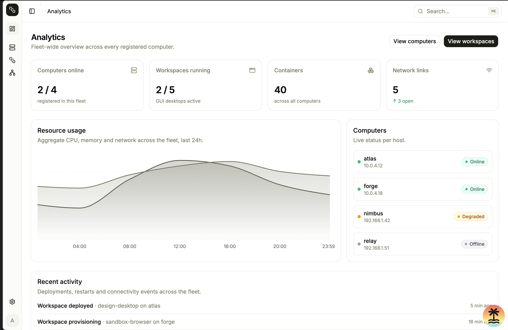
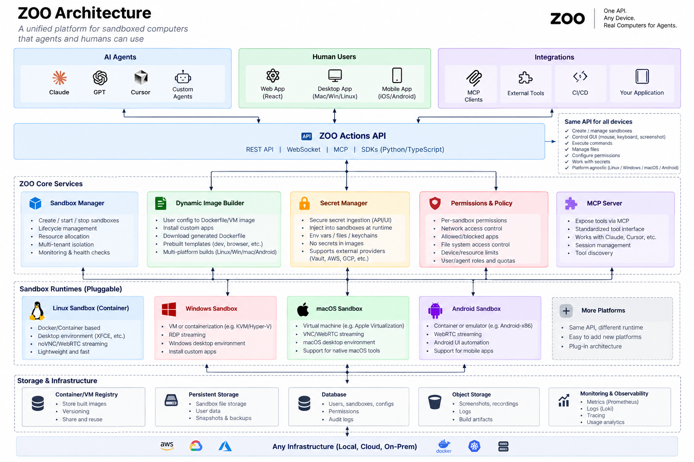

# Agent Sandbox (zoo)

> 🚧 **Early development.** APIs, folder layout, and schemas here are all still shifting — several modules in this repo are placeholder stubs (empty files) marking where the next pieces will land. Nothing here is stable yet.

A lightweight, isolated Linux environment that gives AI agents a real computer they can interact with — a full desktop (browser, filesystem, terminal, GUI) that can be driven programmatically over an HTTP/WebSocket API, with a live view streamed over VNC.

**One API. Any device. Real computers for agents.** That's the direction: a unified platform for sandboxed computers that both agents and humans can use — one API surface, pluggable sandbox runtimes (Linux today, Windows/macOS/Android later), running on any infrastructure.





```text
                 AI Agent
                    │
          ┌─────────┴─────────┐
          │                   │
       Actions             Observe
          │                   │
    click / type          screenshot
    keypress              live VNC
    shell / files          window state
          │                   │
          └─────────┬─────────┘
                    ▼
             Linux Sandbox
          ┌───────────────────┐
          │       XFCE        │
          │     Browser       │
          │     Terminal      │
          │    Filesystem     │
          └───────────────────┘
```

## Target Architecture

This is the full platform we're building toward. Most of it isn't built yet — see [Current Architecture](#current-architecture) below for what actually exists today, and [Roadmap](#roadmap) for the path from here to there.



```text
┌───────────────┐   ┌───────────────┐   ┌──────────────────┐
│   AI Agents    │   │  Human Users  │   │   Integrations    │
│ Claude · GPT ·  │   │ Web · Desktop │   │ MCP Clients ·      │
│ Cursor · Custom │   │ · Mobile App  │   │ External Tools ·   │
│                 │   │               │   │ CI/CD · Your App   │
└───────┬────────┘   └───────┬───────┘   └─────────┬─────────┘
        └────────────────────┼─────────────────────┘
                              ▼
        ┌───────────────────────────────────────────────┐
        │              ZOO Actions API                   │
        │  REST · WebSocket · MCP · SDKs (Python/TS)     │
        │                                                 │
        │  Same API for all devices:                     │
        │  create/manage sandboxes · control GUI          │
        │  (mouse/keyboard/screenshot) · execute commands │
        │  · manage files · configure permissions ·       │
        │  work with secrets · platform agnostic          │
        └───────────────────────┬─────────────────────────┘
                                 ▼
┌─────────────────────────────────────────────────────────────────┐
│                       ZOO Core Services                          │
│                                                                    │
│  Sandbox Manager    Dynamic Image     Secret Manager             │
│  create/start/stop  Builder           secure ingestion, inject   │
│  lifecycle, multi-  user config →     at runtime, no secrets     │
│  tenant isolation,  Dockerfile/VM,    in images, external        │
│  health checks      prebuilt          providers (Vault/AWS/GCP)  │
│                      templates                                    │
│                                                                    │
│  Permissions & Policy               MCP Server                   │
│  per-sandbox perms, network         expose tools via MCP,        │
│  control, allowed apps, fs          standardized tool interface, │
│  access, quotas                     session mgmt, tool discovery │
└──────────────────────────┬──────────────────────────────────────┘
                            ▼
┌─────────────────────────────────────────────────────────────────┐
│                 Sandbox Runtimes (Pluggable)                     │
│                                                                    │
│  Linux (Container)  Windows       macOS          Android          │
│  Docker, XFCE,       VM/KVM/      VM (Apple      Container/       │
│  noVNC/WebRTC,       Hyper-V,     Virtualization),  emulator,     │
│  lightweight ✅      RDP stream   VNC/WebRTC       WebRTC,         │
│                                                     mobile UI      │
│                                             + more platforms       │
│                                             (same API, plug-in)    │
└──────────────────────────┬──────────────────────────────────────┘
                            ▼
┌─────────────────────────────────────────────────────────────────┐
│                   Storage & Infrastructure                       │
│                                                                    │
│  Container/VM       Persistent      Database        Object       │
│  Registry            Storage         users,          Storage      │
│  built images,       sandbox files, sandboxes,       screenshots, │
│  versioning          snapshots      configs, perms,  recordings,  │
│                                      audit logs       logs         │
│                                                                     │
│                   Monitoring & Observability                      │
│                   metrics (Prometheus), logs (Loki), tracing      │
└──────────────────────────┬──────────────────────────────────────┘
                            ▼
        Any Infrastructure — Local · AWS · GCP · Azure ·
                  Docker · Kubernetes · On-Prem
```

## Current Architecture

What's actually implemented today — one slice of the target above: the **Linux (Container) sandbox runtime**, a first cut of the **Actions API**, and the beginning of a **Human Users → Web App** client. Everything else in the target diagram (Windows/macOS/Android runtimes, Dynamic Image Builder, Secret Manager, Permissions & Policy, MCP Server, Agent SDKs, real DB/object storage, monitoring) is not built yet.

```text
                        ┌──────────────────────────┐
                        │   web/  (React + Vite)    │
                        │  SandboxManager · Desktop │
                        └────────────┬──────────────┘
                                     │ REST + WebSocket
                                     ▼
┌────────────────────────────────────────────────────────────────┐
│                    server/  (FastAPI app)                      │
│                                                                  │
│  router.py    → HTTP + WS routes (/sandboxes, exec, click, ws)  │
│  handler.py   → request handlers, wires routes to tools/sandbox │
│  sandbox.py   → sandbox lifecycle via Docker SDK (create/get/   │
│                  delete containers from the zoo-sandbox image)  │
│  tools.py     → action implementations: exec, mouse, keyboard,  │
│                  window management, installed/open/close apps,  │
│                  filesystem (upload/download/read/write/list)   │
│  proxy.py     → WebSocket proxy, bridges client <-> noVNC       │
│  schema.py    → pydantic request/response models                │
│  store.py     → simple JSON-file store (data.json) for state    │
└────────────────────────────┬─────────────────────────────────────┘
                              │ docker SDK (exec / cp / attach)
                              ▼
                ┌───────────────────────────────┐
                │   Sandbox container (per agent) │
                │   Dockerfile + supervisord:      │
                │     Xvfb   → virtual X display   │
                │     XFCE   → desktop environment │
                │     x11vnc → VNC server           │
                │     noVNC  → VNC-over-WebSocket   │
                └───────────────────────────────┘
```

Supporting/planned pieces already scaffolded in the repo (stubs, mapping to boxes in the target architecture):

* **`db/`** — sqlc-driven schema/queries (`schema.sql`, `query.sql`, generated models in `db/generated/`). Currently a placeholder (`authors` table) exercising the sqlc pipeline; intended to become the **Database** box (users, sandboxes, configs, permissions, audit logs), replacing `store.py`'s JSON file.
* **`adapters/`** — `mac.py`, `windows.py` (stubs). Seeds for the **macOS** and **Windows sandbox runtimes**.
* **`tools/`** — `base.py`, `exec.py`, `mouse.py`, `observe.py`, `sync.py` (stubs). Target home for breaking `server/tools.py` up into focused modules as it grows.
* **`integrations/`** — `discord.py`, `slack.py`, `whatsapp.py`. Chat-platform bots/webhooks, part of the **Integrations** layer.
* **`mcp/`** — empty; reserved for the **MCP Server** core service.

## Example

What driving a sandbox looks like today, via the tools already implemented in `server/tools.py`:

```python
sandbox = create_sandbox()

execute_command(sandbox.container_id, "curl https://example.com")
click(sandbox.container_id, x=500, y=300)
type_text(sandbox.container_id, "hello world")
press_key(sandbox.container_id, "Return")
screenshot(sandbox.container_id)

open_app(sandbox.container_id, "firefox-esr")
list_files(sandbox.container_id, "/root")
```

The agent can interact with the environment just like a human using a computer.

## Goals

* Isolated environment for AI agents
* Ephemeral sandboxes
* Browser automation
* Programmatic mouse and keyboard control
* Window management (list/focus/minimize/maximize/close)
* App discovery and control (list installed, open, close)
* Filesystem access (list, read, write, upload, download, move, copy, delete)
* Screenshots and visual observation, plus live VNC streaming
* Per-agent environments
* One API across sandbox runtimes — Linux today, Windows/macOS/Android later
* Simple API
* Fast startup and teardown

## Roadmap

### Done / in place

* ✅ **Desktop sandbox** — Docker image running Xvfb + XFCE + x11vnc + noVNC (`Dockerfile`, `supervisord.conf`, `compose.yml`). This is the **Linux (Container)** sandbox runtime in the target architecture.
* ✅ **Basic Linux tools** — mouse (click/double-click/scroll/drag), keyboard (type/keypress/hotkey), window management, app list/open/close, and filesystem operations (`server/tools.py`).
* ✅ **Sandboxing infra** — per-agent container lifecycle (create/get/delete) via the Docker SDK (`server/sandbox.py`) — an early **Sandbox Manager**.
* ✅ **Actions API** — REST + WebSocket API over FastAPI exposing the above (`server/router.py`, `server/handler.py`), with a WS proxy into noVNC for live desktop streaming — the first slice of the **ZOO Actions API**.
* 🏗️ **Web app (started)** — React/Vite app with a sandbox manager (create/list/delete, run exec/click) and a live desktop viewer over noVNC (`web/`) — the **Human Users → Web App** client.

### Next up

1. **Agent SDK** (Python/TypeScript) — a proper client library wrapping the actions API, so agents don't hand-roll HTTP calls.
2. **Web app** — flesh out `web/` into the full control plane: sandbox fleet view, live desktop control, file browser, command history.
3. **MCP server** — expose sandbox actions (click, type, exec, files, screenshots) as MCP tools (`mcp/`), so MCP clients and coding agents can discover and call them.
4. **Plugins for Claude Code, Codex, and OpenCode** — so those agents can request and drive a sandbox as a native tool, built on the MCP server / SDKs.
5. **Real persistence** — move `server/store.py`'s JSON file over to the sqlc-backed DB layer already scaffolded in `db/` (Database + Object Storage boxes).

### Later (full target architecture)

* **Dynamic Image Builder** — turn user config into a Dockerfile/VM image, install custom apps, prebuilt templates, multi-platform builds.
* **Secret Manager** — secure secret ingestion, injected into sandboxes at runtime, no secrets baked into images, support for external providers (Vault, AWS, GCP).
* **Permissions & Policy** — per-sandbox permissions, network access control, allowed/blocked apps, filesystem access control, device/resource limits, user/agent roles and quotas.
* **Additional sandbox runtimes** — Windows (VM/KVM/Hyper-V, RDP streaming), macOS (VM via Apple Virtualization, VNC/WebRTC), Android (container/emulator, WebRTC, mobile UI automation) — all behind the same Actions API.
* **Monitoring & Observability** — metrics (Prometheus), logs (Loki), tracing, usage analytics.
* **Stronger isolation** — move from Docker containers toward stronger isolation (e.g. microVMs) for untrusted agent workloads.
* **Run anywhere** — local, AWS, GCP, Azure, Docker, Kubernetes, on-prem.

## Why?

AI agents increasingly need access to computers rather than just APIs.

Instead of giving an agent direct access to your infrastructure:

```text
Agent
  ↓
Production systems ❌
```

give it a disposable computer:

```text
Agent
  ↓
Sandbox
  ↓
Browser / Terminal / Files
```

The sandbox can be destroyed when the task is complete.

## Status

🚧 **Early development.**

Core pieces are in place: sandboxing infra (Docker + XFCE desktop), a broad set of Linux control tools (mouse, keyboard, windows, apps, filesystem), and the actions API tying them together. Next up is the Agent SDK, followed by the web app, MCP server, and coding-agent plugins described in the roadmap above — working toward the full multi-runtime platform in [Target Architecture](#target-architecture).
