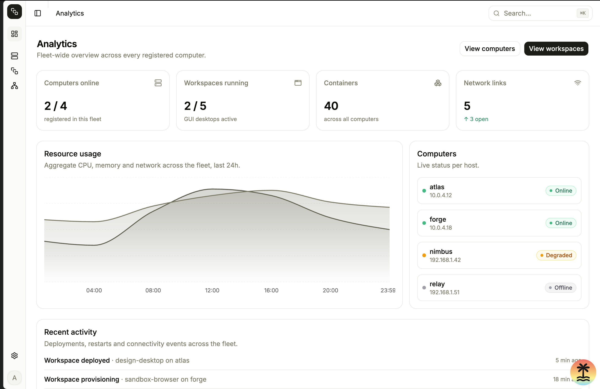
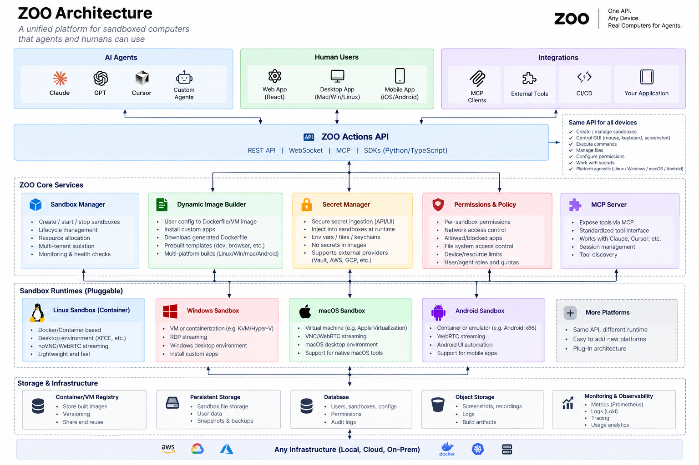

# Zoo

Self-hosted sandboxes for AI agents. Each sandbox is a microVM (a Docker container run under [Kata Containers](https://katacontainers.io), so it gets its own guest kernel) with a Linux desktop, browser or shell, a macOS desktop on a Mac server, or a Windows desktop on a Windows server, that agents control over REST, MCP or a Python SDK. People watch and take over through a live VNC view in the dashboard.

The API and Linux sandboxes need a Linux host with KVM. macOS sandboxes run on Apple Silicon Macs added as servers, and Windows sandboxes on Windows machines with Hyper-V.



## Contents

- [Quickstart](#quickstart)
- [Sandbox types](#sandbox-types)
- [Security model](#security-model)
- [Using it from agents](#using-it-from-agents): MCP, REST, Python SDK, computer-use agent, Claude Code
- [Add a server](#add-a-server)
- [Remote servers](#remote-servers)
- [macOS sandboxes](#macos-sandboxes)
- [Windows sandboxes](#windows-sandboxes)
- [App profiles](#app-profiles)
- [Backups](#backups)
- [Custom domain and HTTPS](#custom-domain-and-https)
- [Observability](#observability)
- [Configuration](#configuration)
- [Local development](#local-development)
- [Project layout](#project-layout)
- [Known limitations](#known-limitations)

## Quickstart

On a fresh Ubuntu or Debian server (bare metal, or a cloud VM with nested virtualization):

```bash
curl -fsSL https://github.com/chann44/zoo/releases/latest/download/install.sh | sudo bash -s -- --admin-email you@example.com
```

The installer:

1. installs Docker if it's missing;
2. installs [Kata Containers](https://katacontainers.io) and registers it with Docker when the host has KVM (`/dev/kvm`), so each sandbox boots in its own lightweight VM. Without KVM, or if Kata can't start a test VM, it falls back to `runc` (plain containers sharing the host kernel) and says so;
3. writes `/opt/zoo/.env` with a fresh `JWT_SECRET` and `ZOO_SECRETS_KEY` (back the latter up: it encrypts stored secrets);
4. downloads the release's pinned `compose.yml`, pulls its signed images and starts the stack;
5. installs the `zoo` operator CLI.

It prints the dashboard URL when the stack is healthy, usually `http://<server ip>:3000` (the API is on `:8000`, OpenAPI docs at `/docs`). Sign up, create a sandbox, then create an API key under **Profile → API keys**. The key is shown once. Options: `--version X.Y.Z`, `--dir PATH`, `--domain HOST` (HTTPS through Caddy, see [Custom domain and HTTPS](#custom-domain-and-https)), `--runc`.

### Operating an install

```bash
zoo upgrade            # back up the database, move to the latest release, roll back if it isn't healthy
zoo upgrade 1.4.2      # or to a given release
zoo backup             # save the database to /opt/zoo/backups
zoo restore FILE       # put a backup back and restart the API
zoo doctor             # check KVM, the sandbox runtime, disk, ports, DNS and the API
```

Migrations run when the new API starts. Running sandboxes keep the image they booted from, across restarts too; their Overview tab offers **Restart on new image** (`POST /sandboxes/{id}/upgrade`), which keeps the home directory.

### Images

Releases publish signed, multi-arch (`linux/amd64`, `linux/arm64`) images to Docker Hub, mirrored to `ghcr.io/chann44`:

| Image | Used for |
| --- | --- |
| `chann44/zoo-api` | FastAPI server, MCP endpoint and job worker |
| `chann44/zoo-web` | the dashboard |
| `chann44/zoo-sandbox-desktop` | `desktop` and `browser` sandboxes (Debian, XFCE, Firefox, noVNC) |
| `chann44/zoo-sandbox-code` | `code` sandboxes (Python 3.12, Node, git, ripgrep, Claude Code) |

Tags: `1.4.2`, `1.4`, `1` and `latest` for releases; `edge` and `sha-<commit>` from `main` (`edge` is rebuilt nightly to pick up patched base images). Each tag is signed with cosign keyless and carries an SBOM and build provenance:

```bash
cosign verify docker.io/chann44/zoo-api:1.4.2 \
  --certificate-identity-regexp '^https://github.com/chann44/zoo/\.github/workflows/images\.yml@' \
  --certificate-oidc-issuer https://token.actions.githubusercontent.com
```

### From a checkout

```bash
cp .env.example .env        # set JWT_SECRET and ZOO_SECRETS_KEY to two different long random strings
docker compose up -d --build
```

`--build` builds the four images from the checkout instead of pulling them. To set up Kata by hand:

```bash
ls /dev/kvm                                  # bare metal, or a cloud VM with nested virtualization
# install Kata Containers 3.x: https://github.com/kata-containers/kata-containers/releases
sudo tee /etc/docker/daemon.json <<'JSON'
{ "runtimes": { "kata": { "runtimeType": "io.containerd.kata.v2" } } }
JSON
sudo systemctl restart docker
docker run --rm --runtime kata alpine uname -r   # prints the guest kernel, not the host's
```

On a machine without KVM (for development), set `ZOO_RUNTIME=runc` in `.env` to run plain containers.

The API talks to Docker through `/var/run/docker.sock` and stores its SQLite database in the `zoo-data` volume. Migrations run on boot.

## Sandbox types

| Type | Display | Tools available | Notes |
| --- | --- | --- | --- |
| `desktop` | XFCE, 1280x720 | all | Firefox, terminal, file manager |
| `browser` | XFCE, 1280x720 | observe, mouse, keyboard, windows, browser | Firefox opens on start (`ZOO_BROWSER_HOME`). No shell. |
| `code` | none | shell, files, `fetch_url` | Claude Code is preinstalled |
| `macos` | macOS, 1280x800 | all | Runs on a Mac server. See [macOS sandboxes](#macos-sandboxes). |
| `windows` | Windows, 1280x800 | all | Runs on a Windows server. See [Windows sandboxes](#windows-sandboxes). |

Every sandbox:

- runs in its own microVM with its own kernel (`ZOO_RUNTIME`, default `kata`);
- runs its processes as the unprivileged user `zoo` (uid 1000);
- keeps `/home/zoo` on its own Docker volume (`zoo-home-<id>`), so files survive stop and start;
- is limited to 2 GB memory, 2 CPUs and 1024 processes, with `no-new-privileges`;
- is reached only through the API. Desktop ports are bound to `127.0.0.1`, or to the compose network.

Stop removes the container and keeps the volume. Start creates a fresh container on the current image and mounts the same volume. Delete removes both.

A container reported as running in the DB but gone from Docker is marked stopped within 15 seconds.

## Security model

Policies are set per sandbox in the dashboard or through the API.

| Control | How it is enforced |
| --- | --- |
| Tool permissions (`shell.exec`, `screen.read`, `input.control`, `files.read`, `files.write`) | Checked by the API before every tool call. A denied call returns 403. |
| Network policy (default allow/deny, DNS on/off, domain, IP and CIDR rules) | iptables `OUTPUT` rules in the sandbox's guest kernel, applied as root. The agent user can't change them. |
| App policy | The app's binary is made executable only by root (`chmod 700`), so `zoo` can't launch it. |
| Secrets | Fernet-encrypted in the DB with `ZOO_SECRETS_KEY` and injected as environment variables when the sandbox starts. |
| Live view | The dashboard opens the VNC websocket with a single-use ticket that expires after 30 seconds (`POST /sandboxes/{id}/vnc-ticket`), never the session token. x11vnc listens only inside the sandbox and has a per-sandbox password that only the API holds; the API logs in with it and offers the browser no auth. |
| Rate limits | `/auth/login`: 20 a minute per IP and 10 a minute per email. `/auth/signup`: 10 an hour per IP. Each API key: 600 requests a minute. Over the limit returns 429 with `Retry-After`. Counts are kept in memory, per API process. |
| Audit | Every tool call is stored with its input, output and status, and shown in the Activity tab. |

Policy changes apply immediately to a running sandbox and are applied again on every start. Secret changes apply on the next start.

## Using it from agents

Every tool is registered once in `server/registry.py` and exposed the same way over REST, MCP and the SDK. `GET /tools?kind=desktop` returns names, parameters and required permissions.

| Category | Tools |
| --- | --- |
| observe | `screenshot` |
| mouse | `click`, `double_click`, `scroll`, `drag` |
| keyboard | `type_text`, `press_key`, `hotkey` |
| windows | `windows_list`, `window_focus`, `window_minimize`, `window_restore`, `window_maximize`, `window_unmaximize`, `window_close` |
| apps | `installed_apps`, `open_app`, `close_app` |
| browser | `open_url` |
| web | `fetch_url` |
| shell | `execute_command` |
| files | `list_files`, `get_file_info`, `read_file`, `write_file`, `create_directory`, `delete_file`, `move_file`, `copy_file` |

### MCP

The MCP server is at `/mcp/` (streamable HTTP) and requires an API key.

```json
{
  "mcpServers": {
    "zoo": {
      "type": "http",
      "url": "http://localhost:8000/mcp/",
      "headers": { "Authorization": "Bearer zoo_..." }
    }
  }
}
```

It exposes every tool, each taking a `sandbox_id`, plus `list_sandboxes`, `create_sandbox` and `get_sandbox`.

### REST

```bash
curl -X POST localhost:8000/sandboxes/$ID/tools/type_text \
  -H "Authorization: Bearer $ZOO_API_KEY" -H "content-type: application/json" \
  -d '{"text": "hello"}'
```

Main endpoints:

| Endpoint | Purpose |
| --- | --- |
| `GET/POST /sandboxes`, `GET/DELETE /sandboxes/{id}` | list, create, get, delete |
| `POST /sandboxes/{id}/start`, `/stop`, `/move` | lifecycle and moving between servers |
| `POST /sandboxes/{id}/tools/{name}` | call a tool with a JSON body of arguments |
| `POST /sandboxes/{id}/screenshot`, `/exec` | shortcuts that return PNG bytes and a shell result |
| `GET /sandboxes/{id}/executions` | tool call log |
| `GET /sandboxes/{id}/backup`, `POST /sandboxes/{id}/restore` | tar of `/home/zoo` |
| `/sandboxes/{id}/permissions`, `/network`, `/network/rules`, `/apps`, `/secrets` | policies |
| `/sandboxes/{id}/profiles`, `/profiles` | app profiles |
| `/servers` | remote servers |
| `/api-keys` | API keys |
| `/monitoring` | host and container metrics |
| `/admin/users`, `/admin/sandboxes`, `/admin/backups`, `/admin/domains` | admin only, set by `ADMIN_EMAILS` |

### Python SDK

```bash
pip install ./sdk/python
```

```python
from zoo_sdk import Zoo

zoo = Zoo()  # reads ZOO_API_KEY and ZOO_URL
box = zoo.create("research", kind="desktop")  # waits until running
box.open_app(command="firefox-esr")
box.click(x=640, y=360)
box.type_text(text="hello")
print(box.exec("ls ~")["stdout"])
open("screen.png", "wb").write(box.screenshot())

box.set_secret("GITHUB_TOKEN", "...")
box.set_network("deny")
box.add_rule("domain", "github.com")
box.backup("box.tar")
box.stop()
```

Any tool can be called as a method (`box.window_focus(window_id=...)`) or with `box.tool(name, **args)`.

### CUA agent (built in)

Every desktop, browser, macOS and Windows sandbox has a [CUA](https://github.com/trycua/cua) computer-use agent on the server. Chat with it from the **Agent** tab on the sandbox page, over the REST API, or from Slack, Discord and WhatsApp. Its actions go through the same tools, permissions and Activity log as API and MCP calls.

Set `ANTHROPIC_API_KEY` on the API (or the key for whichever provider your model uses). `ZOO_AGENT_MODEL` picks the model, as a [CUA model string](https://cua.ai/docs) (default `anthropic/claude-sonnet-5-5`), and `ZOO_AGENT_MAX_STEPS` caps the actions per task (default 100).

| Endpoint | |
| --- | --- |
| `POST /sandboxes/{id}/agent` | `{"message": "...", "model": null, "stream": true}`. Streams server-sent events: `user`, `reasoning`, `action`, `text`, `error`, then `done`. With `"stream": false` it returns all the events once the task is finished. |
| `GET /sandboxes/{id}/agent` | The conversation so far and whether a task is running |
| `GET /sandboxes/{id}/agent/stream` | Attach to the running task's stream (replays it from the start) |
| `POST /sandboxes/{id}/agent/stop` | Cancel the running task |
| `DELETE /sandboxes/{id}/agent` | Clear the conversation |
| `GET/POST/DELETE /sandboxes/{id}/agent/channels` | Link Slack and Discord channels and WhatsApp numbers |

One task runs per sandbox at a time, and it keeps going if the client that started it disconnects. Follow-up messages see the earlier turns as text.

```bash
curl -N -X POST localhost:8000/sandboxes/$ID/agent -H "Authorization: Bearer $ZOO_API_KEY" \
  -H 'Content-Type: application/json' -d '{"message": "Open Firefox and find the weather in Paris"}'
```

```python
for event in Zoo().sandbox(sandbox_id).ask("Open Firefox and find the weather in Paris"):
    print(event["type"], event.get("text", ""))
```

#### Slack, Discord and WhatsApp

Link a channel or phone number to a sandbox under **Agent → Chat channels**. Messages from there start tasks and the agent's progress streams back: Slack and Discord edit one reply as the agent works, and WhatsApp, which can't edit messages, gets a message per step. Send `stop` to cancel and `reset` to clear the conversation. Anyone who can post in a linked channel can control the sandbox, so link private channels.

| Platform | Environment | Setup |
| --- | --- | --- |
| Slack | `SLACK_BOT_TOKEN`, `SLACK_SIGNING_SECRET` | Bot scopes `chat:write`, `channels:history`, `groups:history`; subscribe to `message.channels` and `message.groups` at `<api>/integrations/slack/events`; invite the bot to the channel. Link by channel ID. |
| Discord | `DISCORD_BOT_TOKEN` | Enable the Message Content intent; invite the bot with Send Messages and Read Message History. Link by channel ID. |
| WhatsApp | `WHATSAPP_TOKEN`, `WHATSAPP_PHONE_NUMBER_ID`, `WHATSAPP_VERIFY_TOKEN`, `WHATSAPP_APP_SECRET` | Cloud API webhook at `<api>/integrations/whatsapp/webhook`, subscribed to `messages`. Link the sender's number. |

### Computer-use agent (client side)

A Claude computer-use loop that runs on your machine and drives a sandbox.

Python:

```bash
pip install "./sdk/python[agent]"
```

```python
from zoo_sdk import Zoo
from zoo_sdk.agent import Agent

box = Zoo().create("cua")
print(Agent(box, model="claude-sonnet-5").run("Open Firefox and find the weather in Paris"))
```

TypeScript (`examples/cua-ts`), with the same loop written against the REST API:

```bash
cd examples/cua-ts && bun install
ZOO_API_KEY=zoo_... ANTHROPIC_API_KEY=sk-ant-... bun agent.ts "Open Firefox and find the weather in Paris"
```

Both default to the `computer_20251124` tool with the `computer-use-2025-11-24` beta. If your model uses a different version, override it: `tool_version` and `beta` in Python, `TOOL_VERSION` and `BETA` env vars in TypeScript.

### Claude Code in a code sandbox

```python
box = zoo.create("coder", kind="code", wait=False)
box.set_secret("ANTHROPIC_API_KEY", "sk-ant-...")
box.wait()
box.stop()
box.start()  # restart so the secret is injected
box.exec("git clone https://github.com/you/repo ~/work/repo", timeout=120)
result = box.claude("fix the failing test", cwd="~/work/repo", timeout=900)
print(result["result"])
```

`box.claude()` runs `claude -p ... --output-format json --dangerously-skip-permissions` as the `zoo` user and returns the parsed JSON. `examples/claude_code.py` is the full version, with a deny-by-default network that only allows Anthropic, GitHub, PyPI and npm.

## Add a server

The control plane runs Linux sandboxes on its own machine. Add a server to get more room, or to run another OS:

| Server | Runs |
|---|---|
| Linux (amd64 or arm64; KVM for VM isolation, otherwise runc) | Linux sandboxes |
| Mac (Apple Silicon, macOS 13+) | macOS sandboxes, plus Linux ones with Docker Desktop |
| Windows Pro, Enterprise, Education or Server, with Hyper-V | Windows sandboxes, plus Linux ones with Docker Desktop |

Intel Macs and Windows Home can't run these VMs, so the installer refuses them. A Linux machine without KVM gets runc.

1. In the dashboard, open **Servers**, pick the machine's OS and copy the command. It carries the control plane's SSH key.
2. Run the command on the machine: `curl … | sudo bash -s -- --node …` on Linux or a Mac, PowerShell as administrator on Windows. It runs pre-flight checks first (virtualization, disk, memory, the control plane) and changes nothing if one fails; add `--check` (or `-Check`) to only run them. It then installs what's needed and authorizes the key, then prints a `zoo-join:` line.
3. Paste the join line under **Servers**. It carries the address, platform and SSH host key, so the control plane verifies the machine from its first connection.

The server then appears with what it can run, and the create dialog lists only the sandbox types some server can run; the others say which machine to add. Each server's capabilities are checked again with its status, so installing Docker Desktop later on a Mac adds Linux. macOS and Windows base VMs are built on the server itself (from Apple's IPSW, or a Windows ISO you supply), since neither OS image can be redistributed.

The control-plane installer creates the API's SSH key in `/opt/zoo/ssh`. On other installs, `ZOO_SSH_DIR` (default `~/.ssh`) is mounted read-only into the API, and host keys from join lines go to `/data/known_hosts`.

## Remote servers

**Set up manually instead** under **Servers** takes the same fields by hand. For a Linux machine:

1. Install Docker and Kata Containers and register the `kata` runtime as in the [Quickstart](#quickstart). Add an SSH user to the `docker` group.
2. Make sure the API host can SSH in with a key and no password prompt, and knows the machine's host key.

Then fill in:

- **Docker URL**: `ssh://user@10.0.0.5`, or `tcp://host:2376` for a TLS-configured daemon.
- **Address**: an IP the API can reach, such as a LAN or Tailscale IP. Desktop ports are published on this address, so keep it on a private network.

A server is rejected if its Docker daemon doesn't have the configured runtime. If a server doesn't have the sandbox image, the API pulls it, or copies it over from the main host.

When creating a sandbox you can pick a server or **Least busy server**. To move a stopped sandbox, use the **Server** tab or `POST /sandboxes/{id}/move`. Its home volume is copied to the target and removed from the source. A server can only be removed once no sandboxes are on it.

## macOS sandboxes

A `macos` sandbox is a macOS microVM on an Apple Silicon Mac. The Mac runs `zoovm`, our helper on Apple's Virtualization.framework (`macos/zoovm`). The API reaches the Mac over SSH. It drives the screen, mouse and keyboard through the VM's VNC server and runs the other tools over SSH into the guest, so agents use the same tools as on Linux.

Setup (build `zoovm`, install a base VM, prepare the guest, add the Mac as a **macOS** server) is in [macos/README.md](macos/README.md).

How it differs from Linux sandboxes:

- Stop shuts the VM down and keeps its disk. Start boots the same VM again. Delete removes it.
- macOS runs at most 2 VMs per Mac. **Least busy server** picks a Mac with room.
- Network policy uses `pf` in the guest, and app policy locks `/Applications/<App>.app`. The guest user has sudo, so an agent with `shell.exec` can undo both.
- `installed_apps` lists `.app` bundles and Homebrew packages. `open_app` takes an app name like `Safari`. Window ids look like `Safari:1`.
- Key names follow X11 keysyms as on Linux. Use `cmd` for Command.
- App profiles, moving between servers and monitoring metrics aren't available yet.

## Windows sandboxes

A `windows` sandbox is a Hyper-V VM on a Windows machine. The API reaches the machine over SSH and drives Hyper-V with `windows/zoovm.ps1`, which it uploads itself. Agents use the same tools as on Linux: screen, mouse and keyboard go through a VNC server in the guest, shell and file tools through OpenSSH in the guest, and window and app tools through a small agent in the guest's desktop session.

Setup (turn on Hyper-V and OpenSSH, add the machine as a **Windows** server, install the base VM from an ISO) is in [windows/README.md](windows/README.md). The base VM sets itself up unattended, with no Setup screens to click through.

How it differs from Linux sandboxes:

- Stop shuts the VM down and keeps its disk. Start boots the same VM again. Delete removes it.
- Each sandbox starts from a frozen template of the base VM, so you can change the base while sandboxes run. **Stop** on the base VM saves a new template.
- At most `ZOO_WINDOWS_MAX_VMS` (default 4) run on each server.
- `execute_command` runs PowerShell. Paths are Windows paths, starting at `C:\Users\zoo`.
- Network policy uses Windows Firewall, where block rules always beat allow rules. App policy blocks `.exe` files and can't block Store apps. The guest user is an administrator, so an agent with `shell.exec` can undo both.
- App profiles, moving between servers and monitoring metrics aren't available yet.

## App profiles

Save an app's profile directory (logins, cookies, settings) from a running sandbox and load it into others.

| App | Directory |
| --- | --- |
| `firefox` | `~/.mozilla` |
| `chromium` | `~/.config/chromium` |
| `chrome` | `~/.config/google-chrome` |
| `vscode` | `~/.config/Code` |

Save and load profiles in the sandbox's **Profiles** tab, or choose one in the create dialog to have it loaded before the desktop starts. Profiles are stored as tar files in `PROFILE_DIR`. Close the app before loading a profile into a running sandbox.

## Backups

- **Sandbox files**: the **Backup** button (or `GET /sandboxes/{id}/backup`) downloads `/home/zoo` as a tar. `POST /sandboxes/{id}/restore` with the tar as the body restores it.
- **Database**: `zoo backup` (or `POST /admin/backups`) writes a consistent SQLite copy. `zoo restore FILE` puts one back. `GET /admin/backups` lists the API's copies in `BACKUP_DIR`.

## Custom domain and HTTPS

The `domain` compose profile adds Caddy on ports 80 and 443.

```bash
ADMIN_EMAILS=you@example.com ZOO_PUBLIC_IP=<server ip> docker compose --profile domain up -d --build
```

1. Point an A record at the server.
2. Add the hostname under **Profile → Domains** (admins only). The card shows whether DNS resolves to `ZOO_PUBLIC_IP`.
3. Open `https://your.domain`. Caddy gets a Let's Encrypt certificate on the first request.

Caddy only issues certificates for hostnames listed in the DB, or for `ZOO_DOMAIN`. It checks with `GET /domains/check`. On a custom domain the dashboard calls the API at `https://your.domain/api`, so you don't need to rebuild the web image or configure CORS.

## Observability

Set `OTEL_EXPORTER_OTLP_ENDPOINT` to export OpenTelemetry traces and logs. You get spans for HTTP requests, tool calls (`tool <name>`, with sandbox, user and channel) and SQLite queries. Application logs go to the same endpoint.

The `observability` profile runs Grafana with Tempo, Loki and Prometheus (`grafana/otel-lgtm`):

```bash
OTEL_EXPORTER_OTLP_ENDPOINT=http://lgtm:4318 docker compose --profile observability up -d
```

Grafana is at http://localhost:3001 (admin/admin), or at `ZOO_GRAFANA_DOMAIN` behind Caddy.

## Configuration

| Variable | Default | Purpose |
| --- | --- | --- |
| `JWT_SECRET` | required | Signs sessions |
| `ZOO_SECRETS_KEY` | required for new installs | Encrypts secrets, agent keys, app profiles and VNC passwords. The API won't start without it unless users already exist; those older installs fall back to a key derived from `JWT_SECRET` until they set one and run `make rotate-secrets`. |
| `ZOO_SECRETS_KEY_PREVIOUS` | unset | Old keys, comma-separated, kept only until `make rotate-secrets` has run |
| `FORWARDED_ALLOW_IPS` | `127.0.0.1` | Proxies whose `X-Forwarded-For` the API trusts. Behind Caddy, set it to Caddy's address on the `zoo` network, or every client shares Caddy's per-IP rate limit. |
| `ADMIN_EMAILS` | empty | Comma-separated emails allowed to use `/admin/*` and Domains |
| `CORS_ORIGINS` | `http://localhost:5173,http://localhost:3000` | Allowed dashboard origins |
| `ZOO_API_URL` | `http://localhost:8000` | API URL the dashboard calls, read at container start. `VITE_API_URL` is the fallback for `bun dev`. |
| `DB_PATH` | `./local.db` | SQLite file |
| `BACKUP_DIR` | `./backups` | DB backups |
| `PROFILE_DIR` | `data/profiles` | Saved app profiles |
| `ZOO_NETWORK` | unset | Docker network shared by the API and sandboxes. Compose sets it to `zoo`. |
| `ZOO_RUNTIME` | `kata` | Docker runtime for sandboxes. `runc` runs plain containers without VM isolation. |
| `ZOO_GUEST_URL` | unset | Websocket URL Linux sandboxes on the API's docker host dial to reach the API (`/guest/connect`). Compose sets it to `ws://api:8000/guest/connect`. Unset, tool calls use `docker exec`. |
| `ZOO_GUEST_REMOTE_URL` | unset | The same for sandboxes on remote servers, e.g. `wss://zoo.example.com/guest/connect` |
| `ZOO_MACOS_BASE` | `zoo-macos-base` | zoovm VM that macOS sandboxes are cloned from |
| `ZOO_MACOS_USER` | `admin` | Guest user for macOS sandboxes |
| `ZOO_MACOS_CPUS`, `ZOO_MACOS_MEMORY_MB` | `4`, `8192` | Size of each macOS sandbox |
| `ZOO_WINDOWS_BASE` | `zoo-windows-base` | Hyper-V VM that Windows sandboxes are cloned from |
| `ZOO_WINDOWS_CPUS`, `ZOO_WINDOWS_MEMORY_MB` | `4`, `8192` | Size of each Windows sandbox |
| `ZOO_WINDOWS_MAX_VMS` | `4` | Windows sandboxes running at once on each server |
| `ZOO_VERSION` | `latest` | Release whose images compose runs. `install.sh` pins it and `zoo upgrade` moves it. |
| `ZOO_REGISTRY` | `docker.io/chann44` | Where compose pulls images from |
| `ZOO_SANDBOX_IMAGE` | `$ZOO_REGISTRY/zoo-sandbox-desktop:$ZOO_VERSION` | Image for `desktop` and `browser` sandboxes |
| `ZOO_CODE_IMAGE` | `$ZOO_REGISTRY/zoo-sandbox-code:$ZOO_VERSION` | Image for `code` sandboxes |
| `ZOO_BROWSER_HOME` | `https://duckduckgo.com` | Start page for `browser` sandboxes |
| `ZOO_SSH_DIR` | `~/.ssh` | SSH keys mounted into the API container (compose) |
| `ZOO_DOMAIN` | unset | Always-allowed domain for Caddy |
| `ZOO_PUBLIC_IP` | unset | Used to check domain DNS |
| `ZOO_GRAFANA_DOMAIN` | `grafana.localhost` | Grafana hostname behind Caddy |
| `OTEL_EXPORTER_OTLP_ENDPOINT` | unset | Enables telemetry |
| `OTEL_SERVICE_NAME` | `zoo-api` | Service name in traces |
| `HOST`, `PORT`, `RELOAD` | `127.0.0.1`, `8000`, `1` | API server. The API image sets `HOST=0.0.0.0` and `RELOAD=0`. |

## Local development

Requires Python 3.12 with [uv](https://docs.astral.sh/uv/), [bun](https://bun.sh), [goose](https://github.com/pressly/goose) and Docker.

```bash
docker build -t zoo-sandbox:latest .
docker build -f Dockerfile.code -t zoo-code:latest .
make up                         # migrations + sqlc generate
JWT_SECRET=dev ZOO_SECRETS_KEY=dev-secrets uv run python main.py
cd web && bun install && bun run dev
```

To change the schema, add a migration with `make create name=...` and queries in `db/query.sql`, then run `make up`. The DB client in `db/generated` is generated by sqlc. Don't edit it by hand.

Checks that CI runs on every pull request:

```bash
uv run ruff check . && uv run ruff format --check . && uv run basedpyright && uv run pytest --ignore=tests/e2e
cd web && bun run lint && bun run typecheck && bun run test && bun run build
ZOO_RUNTIME=runc docker compose up -d --build && scripts/e2e.sh     # end to end against real containers
```

`basedpyright` fails only on type errors that aren't in `.basedpyright/baseline.json`; fixing old ones shrinks the baseline.

### CI and releases

- `.github/workflows/ci.yml` runs on every pull request: lint, types and tests for the API and dashboard, `sqlc generate` and goose up/down checks, hadolint, shellcheck and PSScriptAnalyzer, image builds with a Trivy scan (critical CVEs with a fix fail it), the end-to-end suite on runc against the built images, and a build of `zoovm` on macOS. Branch protection requires its **CI passed** job.
- `.github/workflows/release.yml` publishes `edge` and `sha-<commit>` images on every push to `main`. [release-please](https://github.com/googleapis/release-please) keeps a release PR open from conventional commits (`feat:`, `fix:`, `feat!:`); merging it tags `vX.Y.Z`, publishes the versioned images and attaches `install.sh`, the pinned `compose.yml`, `Caddyfile`, the `zoo` CLI, the `zoovm` binary and the Windows scripts to the GitHub release.
- `.github/workflows/nightly.yml` rebuilds `edge` without the cache, runs the end-to-end suite under real Kata, and (once `ZOO_VM_E2E` is set) on the macOS and Hyper-V test servers.

Publishing needs the `DOCKERHUB_USERNAME` and `DOCKERHUB_TOKEN` secrets. `DOCKERHUB_NAMESPACE` (variable, default `chann44`) moves the images to another Docker Hub account.

## Project layout

```
server/            FastAPI app
  sandbox_api.py   sandbox lifecycle, tool calls, VNC proxy, reconcile loop
  policy_api.py    permissions, network, apps, secrets
  servers_api.py   remote servers and app profiles
  admin_api.py     admin, DB backups, domains
  registry.py      tool registry and sandbox types
  tools.py         tool implementations (xdotool, wmctrl, docker exec)
  docker.py        containers, volumes, iptables, multi-host clients
  runtime.py       routes lifecycle and policy calls to Docker, macOS or Windows
  macos.py         macOS VMs over SSH (zoovm); macos_tools.py has their tools
  windows.py       Windows Hyper-V VMs over SSH (zoovm.ps1); windows_tools.py has their tools
  vnc.py           VNC client; vnc_tools.py drives macOS and Windows screens with it
  telemetry.py     OpenTelemetry setup
mcp_tools/         MCP server built from the registry
db/                migrations, queries, generated client
sdk/python/        zoo_sdk and zoo_sdk.agent
examples/          claude_code.py, cua-ts/
web/               dashboard (TanStack Start, React Query, shadcn)
macos/             zoovm (Virtualization.framework helper) and guest setup
windows/           zoovm.ps1 (Hyper-V helper), guest setup and desktop agent
Dockerfile         desktop sandbox image
Dockerfile.code    code sandbox image
Dockerfile.api     API image
Caddyfile          reverse proxy with on-demand TLS
install.sh         one-command installer (Docker, Kata, pinned release)
deploy/zoo         operator CLI: upgrade, backup, restore, doctor
scripts/e2e.sh     runs the end-to-end suite against a running stack
.github/workflows  ci.yml (pull requests), release.yml (images and releases), nightly.yml
```



## Known limitations

- Linux Docker hosts with KVM only. Each microVM uses more memory than a container, beyond the 2 GB guest limit.
- Domain network rules are resolved to IPs when the rule is applied. If a site changes IPs, re-apply the policy or restart the sandbox.
- Sandboxes created before the `zoo` user and iptables were added must be stopped and started once to pick up the new image. Until then, policies and the Apps tab fail with an "outdated image" error.
- On remote servers the noVNC port is published on the address you configure. Anything that can reach that address can reach the port, but x11vnc behind it asks for the sandbox's password, which only the API has. Sandboxes started before VNC passwords were added keep a passwordless x11vnc until they are stopped and started on the rebuilt image.
- Moving a sandbox copies its whole home directory through the API host.
- SQLite with a single API process. Not built for horizontal scaling of the API itself.
