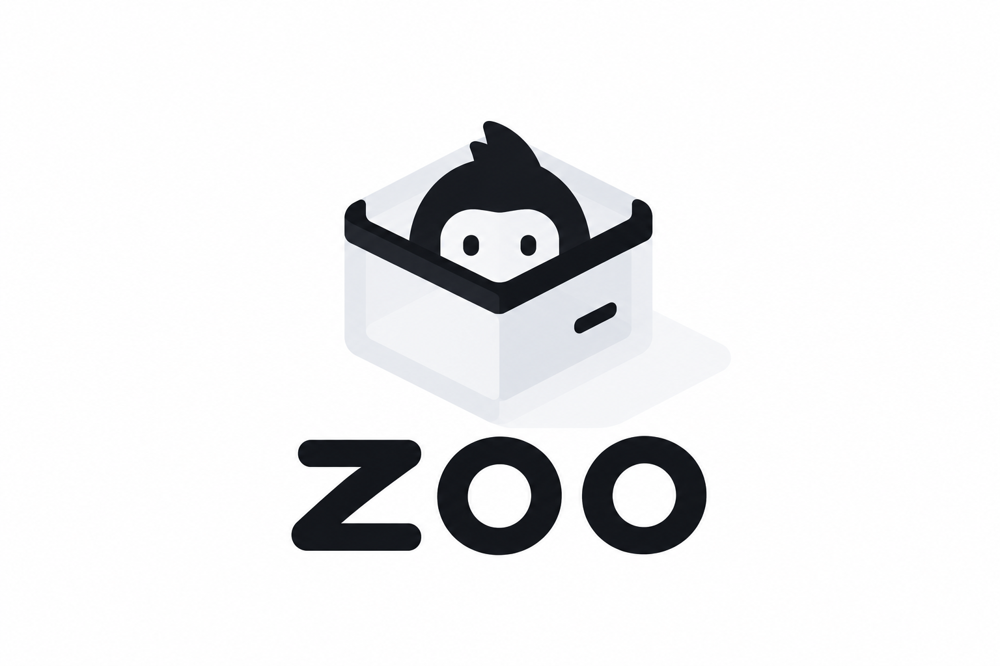

<p align="center">
  
</p>

<p align="center">
  Self-hosted <b>sandboxes</b> for <b>AI agents</b> 🤖🖥️🐧
</p>

<p align="center">
  <a href="https://github.com/chann44/zoo/releases/latest"></a>
  <a href="https://hub.docker.com/r/chann44/zoo-api"></a>
  <a href="docs/install.md"></a>
  <a href="docs/agents.md"></a>
  <br>
  <a href="https://github.com/chann44/zoo"></a>
</p>

<p align="center">
  <a href="#quickstart">Quickstart</a> | <a href="#documentation">Documentation</a>
</p>

<br>

Zoo gives AI agents their own computers: Linux, macOS or Windows desktops, browsers and shells, each in its own microVM. Agents drive them over MCP, REST or a Python SDK. You watch, and take over when needed, from the dashboard.

## Features

- 🔒 [**Isolated**](docs/sandboxes.md) - every sandbox is a microVM with its own kernel
- 🖥️ [**Any OS**](docs/servers.md) - Linux, macOS and Windows desktops, browser-only or headless code sandboxes
- 🔌 [**MCP, REST, Python SDK**](docs/agents.md) - plug into any agent or MCP client
- 🤖 [**Computer-use agent**](docs/agents.md#cua-agent-built-in) - built in, reachable from Slack, Discord and WhatsApp
- 🧑‍💻 [**Claude Code**](docs/agents.md#claude-code-in-a-code-sandbox) - preinstalled in code sandboxes
- 👀 [**Live view**](docs/security.md) - watch and take over any sandbox in the browser
- 🛡️ [**Policies**](docs/security.md) - tool permissions, network rules and app blocking per sandbox
- 🔑 [**Secrets**](docs/security.md) - encrypted, with optional AWS, Google Cloud or Vault KMS
- 📜 [**Audit log**](docs/security.md) - every tool call recorded
- 🗄️ [**Multi-server**](docs/servers.md#remote-servers) - spread sandboxes across machines
- 📦 [**App profiles**](docs/sandboxes.md#app-profiles) - reuse logins and settings across sandboxes
- ⚡ [**One command**](docs/install.md) - a single script installs everything

## Quickstart

On an Ubuntu or Debian server with KVM:

```bash
curl -fsSL https://github.com/chann44/zoo/releases/latest/download/install.sh | sudo bash -s -- --admin-email you@example.com
```

Open `http://<server ip>:3000`, sign up, create a sandbox and an API key. Then connect your agent: see [Using Zoo from agents](docs/agents.md).

## Documentation

- [Install and operate](docs/install.md): installer, upgrades, images, HTTPS, backups
- [Sandboxes](docs/sandboxes.md): sandbox types and app profiles
- [Using Zoo from agents](docs/agents.md): MCP, REST, Python SDK, computer-use agent, Claude Code
- [Servers](docs/servers.md): remote Linux servers, macOS and Windows
- [Security model](docs/security.md)
- [Configuration and observability](docs/configuration.md)
- [Development](docs/development.md): local setup, CI, project layout
- [Known limitations](docs/limitations.md)
